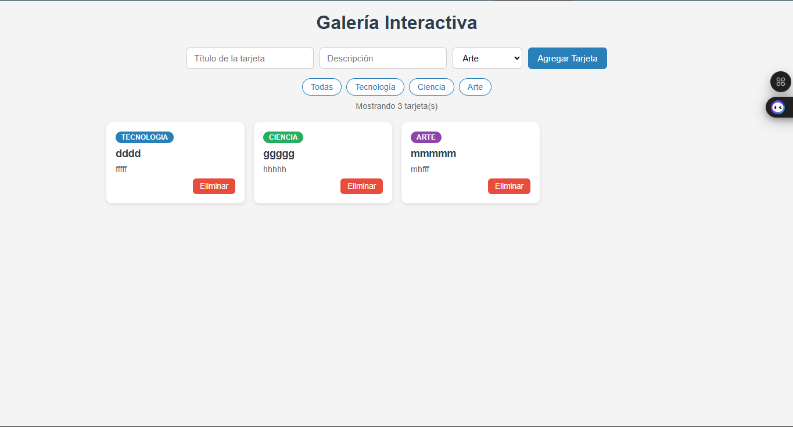

# Galería Interactiva — Unidad 4 JavaScript Básico

Laboratorio Post-Contenido 1 de la asignatura **Programación Web**,  
Ingeniería de Sistemas — Universidad Francisco de Paula Santander, 2026.

## Descripción

Aplicación web que implementa una galería interactiva de tarjetas en  
**JavaScript puro**, sin librerías externas. Permite crear, filtrar y  
eliminar tarjetas dinámicamente aplicando manipulación del DOM, modelo  
de eventos y características de ES6.

## Tecnologías utilizadas

- HTML5
- CSS3
- JavaScript ES6 (vanilla)

## Características implementadas

- Crear tarjetas con título, descripción y categoría
- Eliminar tarjetas con delegación de eventos
- Filtrar tarjetas por categoría (Tecnología, Ciencia, Arte)
- Contador de tarjetas visibles
- Mensaje de galería vacía

## Conceptos aplicados

- Manipulación del DOM: `createElement`, `appendChild`, `remove`, `classList`
- Modelo de eventos: `addEventListener`, `event.target`, delegación de eventos
- ES6: arrow functions, template literals, desestructuración

## Instrucciones de ejecución

1. Clona el repositorio:
2. Abre la carpeta en Visual Studio Code
3. Inicia la extensión **Live Server** sobre `index.html`
4. Abre el navegador en `http://127.0.0.1:5500`

## Capturas de pantalla

## Autor

**Farid Lobo**  
Estudiante de Ingeniería de Sistemas  
Universidad Francisco de Paula Santander — Cúcuta, Colombia
